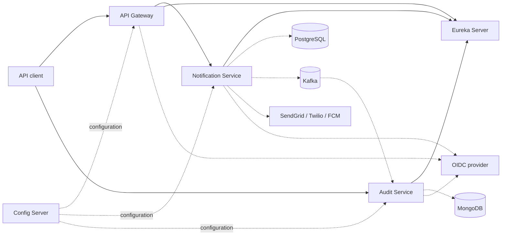
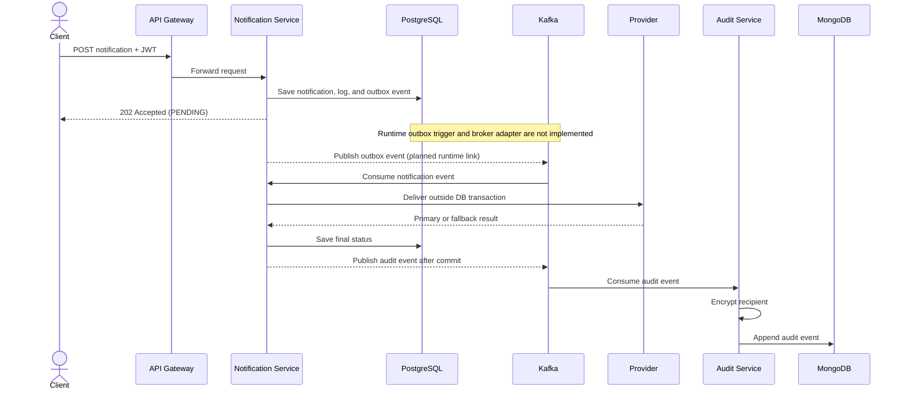
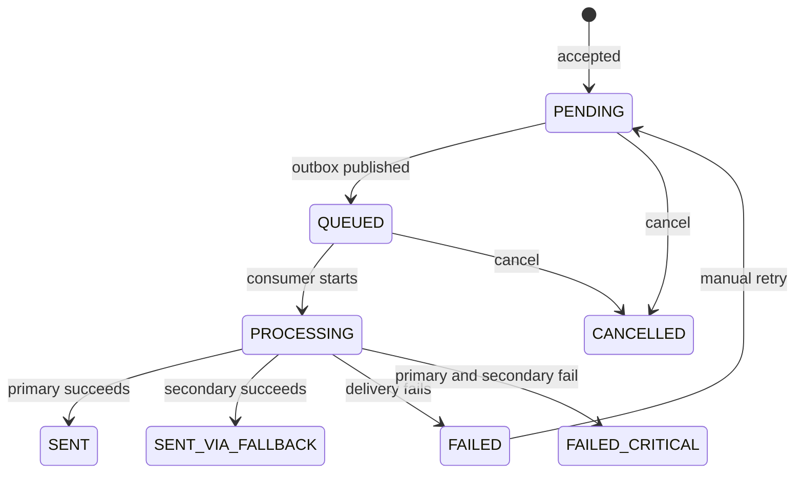
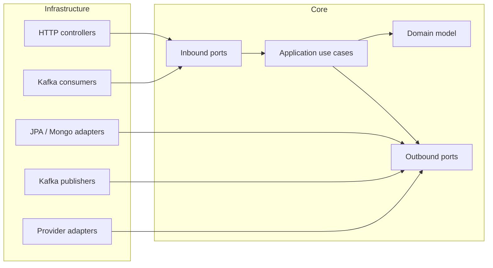

# AegisNotify

[](https://github.com/Exar-lab/AegisNotify/actions/workflows/ci.yml)


AegisNotify is a Java 21 notification orchestration platform for accepting template-based
notifications, persisting their lifecycle, routing work by priority through Kafka, delivering
messages through channel-specific providers, and recording a searchable audit trail.

The repository is organized as five Spring Boot services and applies Hexagonal (Ports and
Adapters) Architecture to the notification and audit domains. Email, SMS, WhatsApp, and push
provider adapters are present. The complete asynchronous delivery path is still under active
development; see [Current implementation status](#current-implementation-status) before trying
to run the full platform.

> [!IMPORTANT]
> The repository contains the core services and most processing behavior, but it is not yet a
> one-command runnable platform. The notification outbox still lacks its Kafka publishing adapter
> and runtime trigger; see [Current implementation status](#current-implementation-status).

## Navigate

- [At a glance](#at-a-glance)
- [Quick start](#quick-start)
- [System topology](#system-topology)
- [Notification processing](#notification-processing)
- [Services and HTTP API](#services)
- [Notification lifecycle](#notification-lifecycle)
- [Kafka interfaces](#kafka-interfaces)
- [Architecture and persistence](#architecture)
- [Configuration and local operation](#configuration)
- [Testing and quality checks](#testing-and-quality-checks)
- [Current implementation status](#current-implementation-status)

## At a glance

| Capability | Current state |
| --- | --- |
| Accept and query notifications over HTTP | Implemented |
| PostgreSQL persistence and Flyway schema | Implemented |
| Email, SMS, WhatsApp, and push provider adapters | Implemented |
| Priority-based Kafka consumer and dead-letter topics | Implemented, disabled by default |
| MongoDB-backed audit ingestion and search | Implemented |
| JWT validation at the gateway and resource services | Implemented |
| Eureka discovery and Git-backed Config Server | Implemented |
| Prometheus actuator endpoints and Kafka consumer counters | Implemented |
| Transactional outbox relay to Kafka | Application use case implemented; runtime trigger and outbound broker adapter are not yet implemented |
| Provider circuit breakers and secondary-account failover | Implemented and unit-tested; production and end-to-end validation remain |
| RabbitMQ transport | Not implemented |
| Docker Compose or bundled local infrastructure | Not provided |

## Quick start

### Prerequisites

- JDK 21
- Docker, if running Testcontainers-based integration tests
- PostgreSQL 15 or newer for `aegis-notification-service`
- Apache Kafka for notification processing and audit events
- MongoDB for `aegis-audit-service`
- An OpenID Connect provider that exposes a JWKS endpoint; the defaults expect a Keycloak realm
  at `http://localhost:8088/realms/aegis`
- Valid SendGrid, Twilio, and Firebase Cloud Messaging credentials to start the notification
  service in its current configuration

Maven does not need to be installed separately because the repository includes `mvnw` and
`mvnw.cmd`.

### Build the repository

Linux, macOS, or Git Bash:

```bash
./mvnw clean package -DskipTests
```

Windows PowerShell or Command Prompt:

```powershell
.\mvnw.cmd clean package -DskipTests
```

Run all verification checks, including tests, Checkstyle, and architecture tests:

```bash
./mvnw clean verify
```

### Start a standalone module

The Eureka server has no external datastore and is the simplest module to run:

```bash
./mvnw -pl aegis-eureka-server spring-boot:run
```

Open `http://localhost:8761` after it starts.

The remaining services require the dependencies and environment variables described below.
There is currently no Docker Compose file in the repository. In addition, the notification
service still requires concrete implementations of `MessageBrokerPort` and
`DeadLetterQueuePort`, plus a trigger for `PublishOutboxEventUseCase`, before the repository can
execute the complete submit-to-delivery flow without test doubles.

## System topology

The gateway, discovery server, and Config Server support two domain services. Dashed connections
below identify runtime dependencies that must be supplied outside this repository.



The gateway currently routes notification submission and status requests only. Audit endpoints
are called directly on port `8083`. Config Server use is optional, but its Git backend and
credentials must be supplied when enabled.

## Notification processing

The intended flow is asynchronous so the HTTP request does not wait for an external provider:



1. `POST /api/v1/notifications` validates the request and recipient format.
2. The notification service verifies that the requested template exists and is active.
3. A notification, its initial log entry, and an outbox event are stored in one PostgreSQL
   transaction. The API returns `202 Accepted` with the notification ID and `PENDING` status.
4. `PublishOutboxEventService` maps `HIGH`, `MEDIUM`, and `LOW` priority events to separate Kafka
   topics, marks the outbox event processed, and advances the notification to `QUEUED`.
5. When enabled, `KafkaNotificationConsumer` consumes the priority topics with manual
   acknowledgment and delegates processing to the application layer.
6. The template is rendered, the notification becomes `PROCESSING`, and the channel provider is
   called outside the database transaction.
7. The final provider result is persisted as `SENT`, `SENT_VIA_FALLBACK`, `FAILED`, or
   `FAILED_CRITICAL`.
8. Lifecycle audit events are published to `notification-audit-events` after the surrounding
   database transaction commits. The audit service encrypts the recipient and atomically appends
   each event to a MongoDB audit-trail document.

Steps 4 through 7 describe implemented application and consumer behavior, but the repository
does not yet contain the runtime outbox trigger or the concrete outbound broker/DLT adapters
needed to connect the entire path.

## Services

| Module | Default port | Responsibility |
| --- | ---: | --- |
| [`aegis-api-gateway`](aegis-api-gateway/) | 8080 | Reactive entry point, JWT validation, CORS, and Eureka load-balanced notification routes |
| [`aegis-eureka-server`](aegis-eureka-server/) | 8761 | Netflix Eureka service registry |
| [`aegis-config-server`](aegis-config-server/) | 8888 | HTTP Basic-protected, Git-backed Spring Cloud Config server |
| [`aegis-notification-service`](aegis-notification-service/) | 8082 | Notification API, domain lifecycle, PostgreSQL persistence, outbox use case, Kafka consumer, and provider delivery |
| [`aegis-audit-service`](aegis-audit-service/) | 8083 | Kafka audit ingestion, recipient encryption, MongoDB persistence, and audit queries |

## HTTP API

All business endpoints require a bearer JWT. Requests sent directly to the notification service
and audit service are validated again instead of relying only on gateway security.

### Submit a notification

`POST /api/v1/notifications`

The token must include the `notification:write` scope when calling the notification service.

```bash
curl -i -X POST http://localhost:8080/api/v1/notifications \
  -H "Authorization: Bearer $ACCESS_TOKEN" \
  -H "Content-Type: application/json" \
  -d '{
    "channel": "EMAIL",
    "recipient": "user@example.com",
    "templateName": "welcome-email",
    "parameters": {
      "name": "Ada"
    },
    "priority": "HIGH"
  }'
```

Successful response: `202 Accepted`

```json
{
  "id": "2a415e3e-a684-4ad7-897d-490c7c75be91",
  "status": "PENDING"
}
```

The response includes a `Location` header pointing to the status resource. `parameters` defaults
to an empty object and `priority` defaults to `MEDIUM` when omitted.

Supported request values:

| Field | Values or constraint |
| --- | --- |
| `channel` | `EMAIL`, `SMS`, `WHATSAPP`, or `PUSH` |
| `recipient` | Email address for email; E.164 number beginning with `+` for SMS/WhatsApp; non-blank device token for push |
| `templateName` | Active template name, maximum 120 characters |
| `parameters` | JSON object used during template rendering |
| `priority` | `HIGH`, `MEDIUM`, or `LOW` |

Templates are persisted in PostgreSQL, but the repository currently has no template management
endpoint and no seed migration. At least one active template must be provisioned before a submit
request can succeed.

### Query notification status

`GET /api/v1/notifications/{id}/status`

```bash
curl -H "Authorization: Bearer $ACCESS_TOKEN" \
  http://localhost:8080/api/v1/notifications/2a415e3e-a684-4ad7-897d-490c7c75be91/status
```

The response includes the notification identity, channel, recipient, template, current status,
timestamps, and its PostgreSQL-backed notification log.

### Query an audit trail

`GET /api/v1/audit/{notificationId}`

```bash
curl -H "Authorization: Bearer $ACCESS_TOKEN" \
  http://localhost:8083/api/v1/audit/2a415e3e-a684-4ad7-897d-490c7c75be91
```

### Search audit trails

`GET /api/v1/audit`

Optional query parameters are `channel`, `status`, `from`, `to`, `page`, and `size`. Page numbers
are zero-based, the default size is 20, and the repository adapter caps the effective size at
100.

```bash
curl -G -H "Authorization: Bearer $ACCESS_TOKEN" \
  --data-urlencode "channel=EMAIL" \
  --data-urlencode "status=SENT" \
  --data-urlencode "page=0" \
  --data-urlencode "size=20" \
  http://localhost:8083/api/v1/audit
```

## Notification lifecycle



Cancellation, manual retry, and manual DLT application use cases exist in source code, but they
are not exposed by the current HTTP controller. `CANCELLED` is present in the domain model; the
initial notification-table Flyway constraint does not yet include it, so cancellation persistence
requires further migration work.

> [!NOTE]
> The diagram shows domain-supported transitions. The current HTTP surface supports submission
> and status queries, not cancellation, retry, or manual DLT operations.

## Kafka interfaces

### Notification topics

| Purpose | Default topic |
| --- | --- |
| High-priority notifications | `high-priority-topic` |
| Medium-priority notifications | `medium-priority-topic` |
| Low-priority notifications | `low-priority-topic` |
| Dead letters | Source topic plus `-dlt`, for example `high-priority-topic-dlt` |

The configured topology uses three partitions, replication factor 3, and
`min.insync.replicas=2`. Activate the `local` Spring profile for the notification service when
using a single local broker; `application-local.yml` changes replication factor and minimum
in-sync replicas to 1.

The notification listener is disabled by default. Enable it with:

```bash
export NOTIFICATION_KAFKA_CONSUMER_ENABLED=true
```

The consumer uses manual acknowledgment, `auto.offset.reset=earliest`, two retries with a
one-second fixed backoff, and then publishes to the corresponding `-dlt` topic. Micrometer
counters record successful deliveries, failures, retries, and DLT publication by source topic.

`NOTIFICATION_KAFKA_RELAY_ENABLED` exists in configuration, but no runtime component currently
uses it to schedule or invoke the outbox publisher. Also note that `PublishOutboxEventService`
currently maps priorities to the three default topic names directly rather than reading renamed
topic values from configuration.

### Audit topic

The notification service publishes audit events to `notification-audit-events`, keyed by
notification ID to preserve per-notification ordering. Publication is deferred until after a
database transaction commits and is fire-and-forget; publishing can be disabled with
`audit.publishing.enabled=false`, which activates a logging fallback.

The audit service consumes with manual acknowledgment and retries failed records with a fixed
one-second backoff before Spring Kafka's dead-letter recoverer handles them. The audit consumer
starts whenever the audit service starts.

## Architecture

The notification and audit services use Hexagonal Architecture. Dependencies point inward;
infrastructure implements application ports rather than leaking framework concerns into the core.



| Boundary | Responsibility |
| --- | --- |
| `domain/` | Pure entities, value objects, enums, state transitions, and domain exceptions |
| `application/` | Inbound use-case ports, outbound dependency ports, DTOs, and orchestration services |
| `infrastructure/` | HTTP and Kafka inbound adapters; JPA, MongoDB, Kafka, encryption, provider, Spring configuration, and security adapters |

The domain does not import Spring or persistence frameworks. ArchUnit tests in both domain
services enforce these boundaries.

The notification workflow uses short transactions around state changes and deliberately performs
blocking provider HTTP calls outside a database transaction, avoiding long-held connections and
row locks.

## Persistence

### PostgreSQL

Flyway migrations in
[`aegis-notification-service/src/main/resources/db/migration`](aegis-notification-service/src/main/resources/db/migration/)
create:

- `templates` for channel-specific subject/body templates and variable declarations
- `notifications` for current notification state and provider outcome
- `outbox_events` for transactional message publication
- `notification_logs` for the notification service's local lifecycle history

JPA validates the schema at startup (`ddl-auto: validate`); Flyway owns schema changes.

### MongoDB

The audit service stores one document per notification ID. Each consumed event is encrypted and
atomically appended to the document's `events` array while `currentStatus` and `updatedAt` are
updated. Search supports status, channel, and creation-time filters.

Recipient values are encrypted with AES-GCM before persistence. Production startup requires
`AUDIT_ENCRYPTION_KEY`; the `local` profile provides a development-only fallback key.

## Security

| Component | Behavior |
| --- | --- |
| API Gateway | JWT resource server; health and info are public; all other routes require authentication |
| Notification service | Stateless JWT resource server; submit requires `SCOPE_notification:write`; status requires authentication |
| Audit service | Stateless JWT resource server; audit queries require authentication |
| Config Server | HTTP Basic authentication using environment-provided credentials |

The default JWKS URI points to Keycloak, but Keycloak configuration is not included in this
repository. Supply `JWKS_URI` to use another compatible OpenID Connect provider.

Actuator `health`, `info`, and `prometheus` endpoints are public in the notification and audit
services. Review that exposure before production deployment.

## Resilience and delivery providers

The provider adapters call:

- SendGrid Mail Send API for `EMAIL`
- Twilio Messages API for `SMS`
- Twilio Messages API with `whatsapp:` addressing for `WHATSAPP`
- Firebase Cloud Messaging HTTP v1 API for `PUSH`

Each provider request has a five-second timeout and maps vendor or transport failures to a failed
provider result.

### Circuit breakers and provider failover

`ResilientNotificationProviderAdapter` is the implemented `NotificationProviderPort` adapter. It
wraps primary providers with one Resilience4j circuit breaker per channel and attempts an optional
secondary account when the primary call fails or its circuit is open. Secondary success produces
`SENT_VIA_FALLBACK`; failure of both attempts produces `FAILED_CRITICAL` for DLT handling.

Focused unit tests cover primary success, fallback success, dual failure, circuit opening, and
half-open recovery. This is still **not a production guarantee**: no end-to-end provider
environment, load behavior, operational thresholds, or production failover has been validated by
this documentation change. Secondary accounts are optional, while every primary provider
credential is required at notification-service startup.

## Configuration

The most important environment variables are:

| Variable | Default | Used by |
| --- | --- | --- |
| `DB_URL` | `jdbc:postgresql://localhost:5432/aegisnotify` | Notification service |
| `DB_USERNAME` / `DB_PASSWORD` | `aegis` / `aegis` | Notification service |
| `KAFKA_BOOTSTRAP_SERVERS` | `localhost:9092` | Notification and audit services |
| `MONGODB_URI` | `mongodb://localhost:27017/aegisnotify-audit` | Audit service |
| `AUDIT_ENCRYPTION_KEY` | None outside `local` profile | Audit service |
| `JWKS_URI` | Keycloak realm at `localhost:8088` | Gateway, notification, and audit services |
| `CONFIG_SERVER_USER` / `CONFIG_SERVER_PASSWORD` | None | Config Server |
| `CONFIG_REPO_URI` | None | Config Server Git backend |
| `CONFIG_REPO_USERNAME` / `CONFIG_REPO_TOKEN` | None | Private Config Server Git backend |
| `CORS_ALLOWED_ORIGINS` | `http://localhost:3000` | API Gateway |
| `SENDGRID_API_KEY` / `SENDGRID_FROM_ADDRESS` | Empty / `noreply@aegisnotify.com` | Email provider |
| `TWILIO_ACCOUNT_SID` / `TWILIO_AUTH_TOKEN` | Empty | SMS and WhatsApp providers |
| `TWILIO_SMS_FROM_NUMBER` / `TWILIO_WHATSAPP_FROM_NUMBER` | Empty | SMS and WhatsApp providers |
| `FCM_PROJECT_ID` / `FCM_ACCESS_TOKEN` | Empty | Push provider |
| `NOTIFICATION_KAFKA_CONSUMER_ENABLED` | `false` | Notification Kafka listener |
| `NOTIFICATION_KAFKA_RELAY_ENABLED` | `false` | Reserved for the unfinished outbox relay runtime |

Secondary provider variables follow the same names with a `_SECONDARY_` segment, for example
`SENDGRID_SECONDARY_API_KEY`, `TWILIO_SECONDARY_AUTH_TOKEN`, and
`FCM_SECONDARY_ACCESS_TOKEN`. See
[`aegis-notification-service/src/main/resources/application.yml`](aegis-notification-service/src/main/resources/application.yml)
for the complete topic, provider, and circuit-breaker configuration.

## Running services locally

Start external infrastructure first, then run repository modules in this order when needed:

1. Eureka Server
2. Config Server, if using centralized configuration
3. Notification Service and Audit Service
4. API Gateway

Commands:

```bash
./mvnw -pl aegis-eureka-server spring-boot:run
./mvnw -pl aegis-config-server spring-boot:run
./mvnw -pl aegis-notification-service spring-boot:run -Dspring-boot.run.profiles=local
./mvnw -pl aegis-audit-service spring-boot:run -Dspring-boot.run.profiles=local
./mvnw -pl aegis-api-gateway spring-boot:run
```

These commands match the Maven modules, but the complete submit-to-delivery flow is blocked by the
missing notification outbox broker adapter, DLT adapter, and relay trigger described above. The
Config Server also requires its Git repository and Basic Auth environment variables, and the
domain services require their datastores, broker, identity provider, and secrets.

## Observability

The gateway, notification service, and audit service expose configured actuator endpoints under
`/actuator`. Prometheus scraping is available at `/actuator/prometheus` where enabled.

The notification service publishes these custom Micrometer counters with a `topic` tag:

- `notification.kafka.consumer.success`
- `notification.kafka.consumer.failure`
- `notification.kafka.consumer.retry`
- `notification.kafka.consumer.dlt`

Spring Boot renders the names in Prometheus format, for example
`notification_kafka_consumer_success_total`.

The Resilience4j configuration registers circuit-breaker health indicators for the four provider
channels. No Prometheus server, dashboards, alert rules, or distributed tracing collector are
included in the repository.

## Testing and quality checks

```bash
# Run all tests and build-time checks
./mvnw clean verify

# Run one module and its required reactor dependencies
./mvnw -pl aegis-notification-service -am test

# Run Checkstyle explicitly
./mvnw checkstyle:check
```

The test suite includes JUnit 5 unit and web-layer tests, Spring context tests, ArchUnit boundary
tests, Kafka integration tests, Prometheus metric tests, and Testcontainers dependencies for
PostgreSQL, Kafka, and MongoDB integration testing.

## Project structure

```text
AegisNotify/
├── aegis-api-gateway/           # Reactive routing and centralized JWT validation
├── aegis-audit-service/         # Kafka-to-MongoDB audit trail service
├── aegis-config-server/         # Git-backed Spring Cloud Config server
├── aegis-eureka-server/         # Service registry
├── aegis-notification-service/  # Notification domain, API, outbox, Kafka, and providers
├── mvnw                          # Unix Maven wrapper
├── mvnw.cmd                      # Windows Maven wrapper
└── pom.xml                       # Parent build and five-module reactor
```

## Current implementation status

This repository is an active portfolio project, currently version `0.7.0`.

Stable, source-backed building blocks include the domain models, HTTP contracts, PostgreSQL/Flyway
and MongoDB persistence, audit encryption, Kafka consumers and error handling, provider HTTP
adapters, service discovery, gateway routing, JWT validation, metrics, and architecture tests.

The following work remains before the documented asynchronous platform is complete:

- Implement `MessageBrokerPort` for publishing notification outbox events to Kafka.
- Implement `DeadLetterQueuePort` for application-driven critical failures.
- Add a runtime trigger that invokes `PublishOutboxEventUseCase` and honors
  `notification.kafka.relay.enabled`.
- Make the outbox publisher use configured topic names instead of hard-coded defaults.
- Add template provisioning through a migration, administrative API, or operational process.
- Expose or intentionally remove the currently internal cancellation, manual retry, and manual DLT
  use cases.
- Validate Resilience4j and secondary-provider behavior in an end-to-end provider environment and
  define production thresholds and operational procedures.
- Add deployment assets and an end-to-end local environment if the project is intended to run as
  a complete stack from a fresh checkout.

## Technology stack

- Java 21
- Spring Boot 3.4.1 and Spring Cloud 2024.0.0
- Spring MVC, Spring WebFlux/WebClient, Spring Security, and OAuth2 Resource Server
- Spring Data JPA, PostgreSQL, Flyway, Spring Data MongoDB
- Apache Kafka and Spring Kafka
- Netflix Eureka and Spring Cloud Gateway/Config
- Micrometer and Prometheus registry
- Resilience4j 2.2.0 for per-channel circuit breakers and secondary-account failover
- JUnit 5, Spring Boot Test, Spring Kafka Test, Testcontainers, and ArchUnit
- Maven Wrapper and Google Checkstyle

## License

This project is part of a personal portfolio. All rights reserved.
